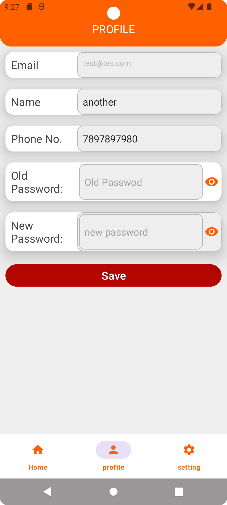

# Suchna Walla - Online Notice Board Android Application

Welcome to the **Suchna Walla** Android application repository! Suchna Walla is an online notice board type application designed to provide students with easy access to notices, allowing them to interact with notices, comment on them, update their profiles, and customize settings. This readme will guide you through setting up the project and understanding its features.

## Screenshots

Check out the [screenshots](./readme) folder to see the visuals of the application.

<div align="center">
   &nbsp;&nbsp;
   &nbsp;&nbsp;
   &nbsp;&nbsp;
</div>

<div align="center">
   &nbsp;&nbsp;
   &nbsp;&nbsp;
   &nbsp;&nbsp;
</div>

## Features

- User Authentication using Firebase Auth
- Real-time Notice Management with Firestore Database
- Notice Reaction and Commenting
- User Profile Management
- Settings Customization

## Getting Started

Follow these steps to set up the project on your local machine and integrate it with your Firebase account:

### Prerequisites

- Android Studio (latest version recommended)
- Firebase Account (for setting up authentication and database)

### Setup

1. **Clone the repository:**

    ```bash
    git clone https://github.com/your-username/suchna-walla.git
    ```

2. **Open the Project in Android Studio:**

    Open Android Studio and select "Open an existing Android Studio project." Navigate to the cloned repository's directory and open the project.

3. **Firebase Setup:**

   - Create a new project on the [Firebase Console](https://console.firebase.google.com/).
   - In the Firebase project, set up **Firebase Authentication** for email/password sign-in method.
   - Set up **Firestore Database** to store notices and user data.

4. **Integrate Firebase Configuration:**

    Open the `app` module's `build.gradle` file and add your Firebase configuration:

    ```groovy
    dependencies {
        // ...
        implementation 'com.google.firebase:firebase-auth:20.0.1'
        implementation 'com.google.firebase:firebase-firestore:23.0.1'
        // ...
    }
    ```

    Add your Firebase SDK configuration to the `AndroidManifest.xml` file within the `<application>` tag:

    ```xml
    <meta-data
        android:name="com.google.firebase.messaging.default_notification_channel_id"
        android:value="@string/default_notification_channel_id" />
    <meta-data
        android:name="com.google.firebase.messaging.default_notification_icon"
        android:resource="@drawable/ic_notification" />
    <!-- Add other Firebase config here -->
    ```

5. **Run the Application:**

    Build and run the application on an emulator or a physical device.

## Contributing

Feel free to contribute to the project by submitting issues and pull requests. Your contributions are highly appreciated!

## License

This project is licensed under the [MIT License](./LICENSE).

---

Thank you for using Suchna Walla! If you have any questions or need further assistance, don't hesitate to contact us.

**Disclaimer:** This readme is a template and should be customized to suit your project's specifics. Make sure to replace placeholders with actual information and adapt the instructions accordingly.
